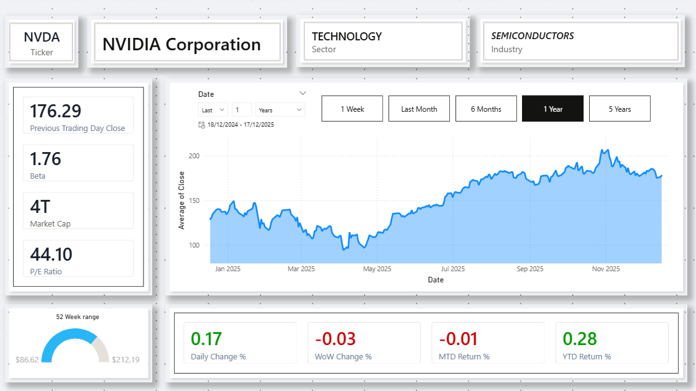
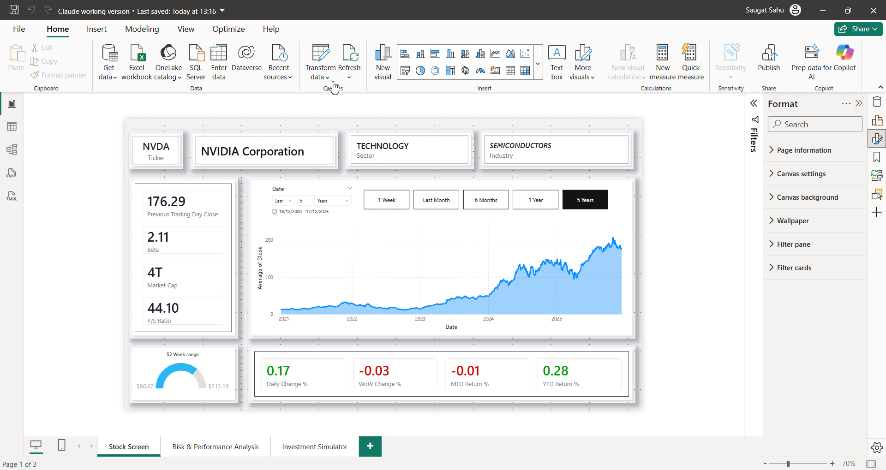
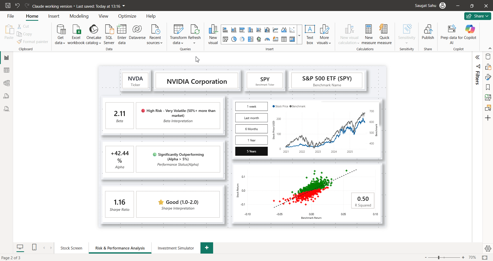
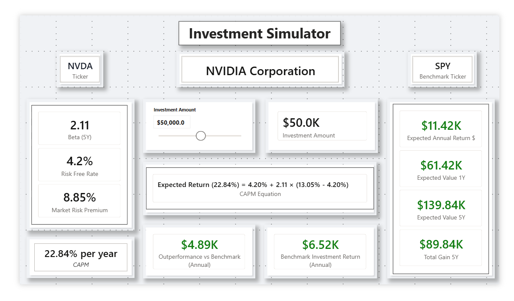
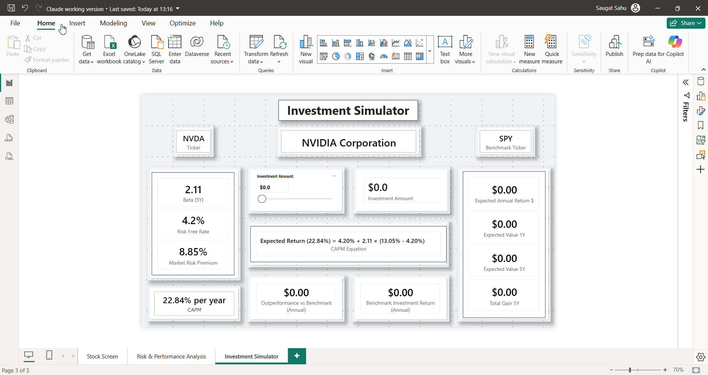

# 📈 Investment Analysis & Simulation Dashboard

  

## 📖 Executive Summary
This project is an advanced financial dashboard designed to bridge the gap between historical analysis and future wealth projection. Unlike standard stock trackers, this tool allows users to **simulate investment outcomes** based on institutional financial models.

The dashboard helps investors answer: *"If I invest $10,000 in this stock today, what is my statistically expected return over 5 years compared to the market?"*

[👉 **Click here to read the explanation of Financial Concepts (Beta, Alpha, CAPM) used in this dashboard.**](FINANCIAL_LOGIC.md)

---

## 🎮 Dashboard Walkthrough

### 1. Stock Screening
A unified view of real-time price performance, 52-week range, and technical indicators.
* **Visuals:** Dynamic Line Chart, 52-Week Gauge, Key Financial Metrics (PE Ratio, Market Cap).
* **Interaction:** Users can switch stock tickers instantly.

*Figure 1: Overview of Stock Performance*

*Demo: Switching tickers updates the entire context of the report.*

### 2. Risk & Performance Analysis
The core analytical engine. It compares the volatility of the chosen stock against a benchmark (S&P 500).

* **High vs. Low Beta:** Notice the contrast below between a **High Volatility** stock (Nvidia) and a **Defensive** stock (Coca-Cola).

| **High Volatility (Nvidia)** | **Low Volatility (Coca-Cola)** |
|:---:|:---:|
|  |  |
| *Beta: ~1.76 (Aggressive)* | *Beta: ~0.08 (Defensive)* |

* **Dynamic Analysis:** See how the risk profile (Scatter Plot & Beta) shifts instantly when selecting different stocks.

*Demo: Live recalculation of risk metrics when switching assets.*

* **Benchmark Switching:** Users can change the comparison baseline (e.g., from S&P 500 to Nasdaq) to see how relative performance shifts.

*Demo: Adjusting the Benchmark Parameter instantly recalculates Alpha and Beta.*

### 3. Investment Simulator (CAPM Engine)
Allows users to model wealth generation using the **Capital Asset Pricing Model**.
* **Inputs:** Investment Capital Slider (0 - $100k).
* **Outputs:** Projected Value (1Y & 5Y), Total Gain, and Annualized Alpha.

*Demo: The simulator calculates compound interest in real-time as capital is adjusted.*

---

## 🛠️ Technical Implementation

### Data Modeling & DAX
* **Disconnected Parameter Tables:** Used for the "Investment Amount" slider to enable "What-If" analysis without filtering the dataset.
* **Dynamic Measures:**
    * `Beta` = `COVARIANCE.P(Stock, Market) / VAR.P(Market)`
    * `Expected Return` = `RiskFree + Beta * (MarketReturn - RiskFree)`

### Financial Logic
For a detailed breakdown of the math (Beta, Alpha, R-Squared) and the CAPM formula used in this tool, please see the [**Financial Logic Documentation**](FINANCIAL_LOGIC.md).

## 🚀 How to Run
1.  Download the `.pbix` file.
2.  Open in **Power BI Desktop**.
3.  Navigate to the **Investment Simulator** page.
4.  Adjust the slider to simulate your own investment scenarios.
